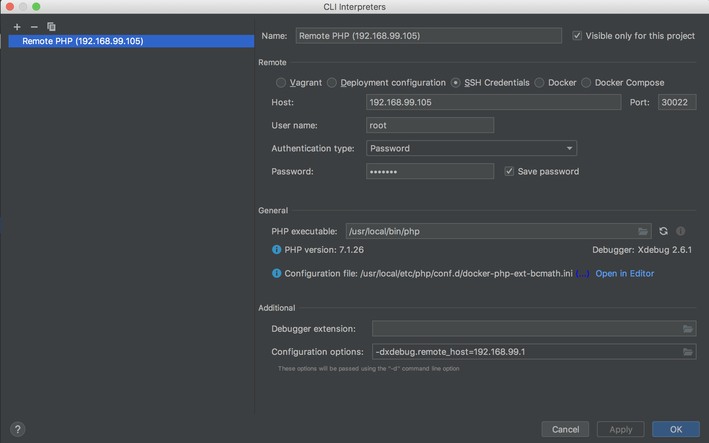
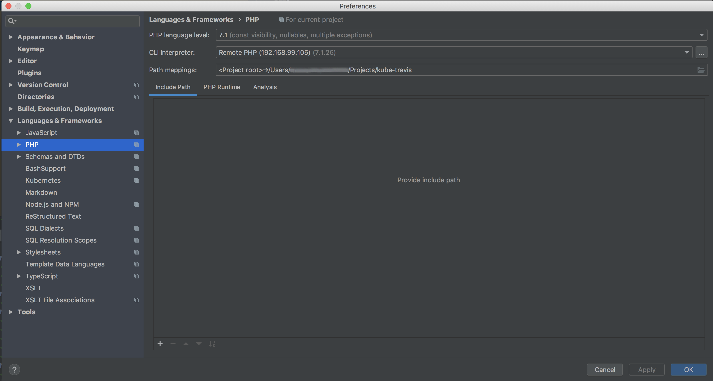
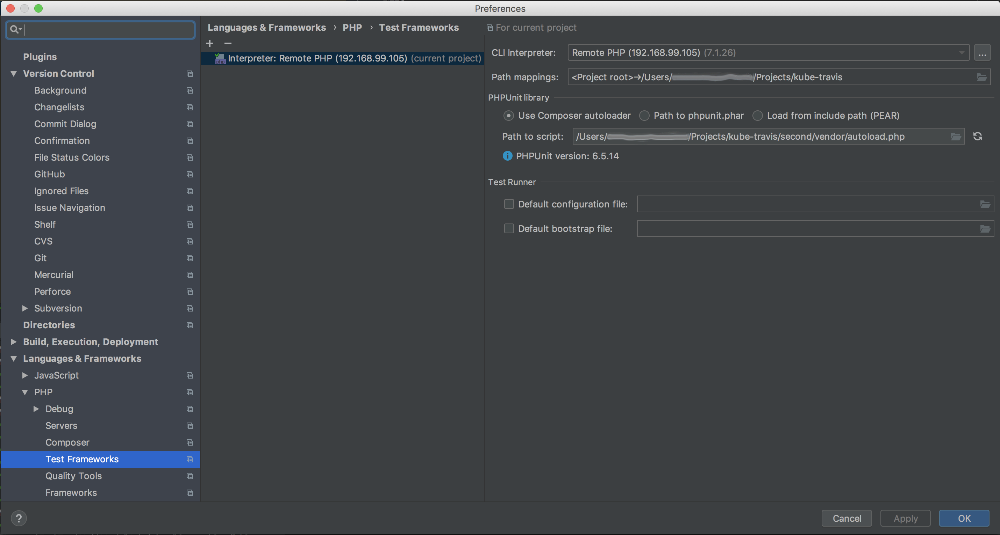

# Running Magento tests from PhpStorm using remote PHP in Kubernetes cluster

It is possible to run Magento tests using remote PHP interpreter from the kubernetes cluster.

1. Configure remote PHP interpreter in PhpStorm with credentials `root:123123q`. Use the IP which you get by running `minikube ip` and port `30022`

1. Select configured remote PHP interpreter

1. Configure PhpUnit to use the configured remote PHP interpreter

When remote PHP configuration is successfully completed run the tests from PhpStorm as usual.
